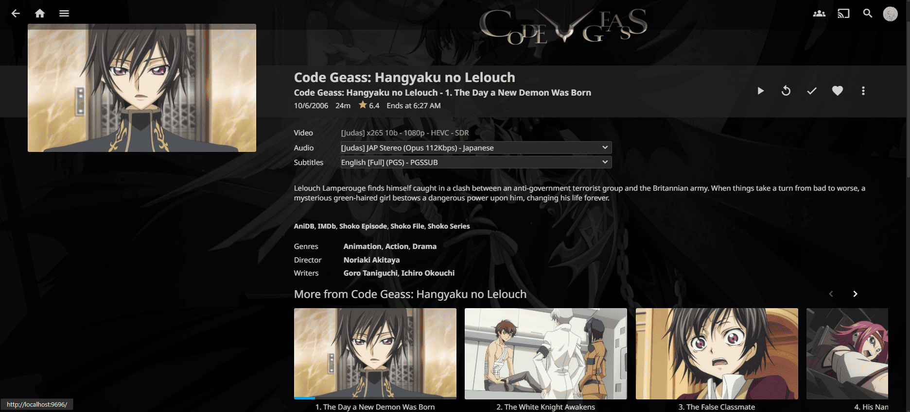
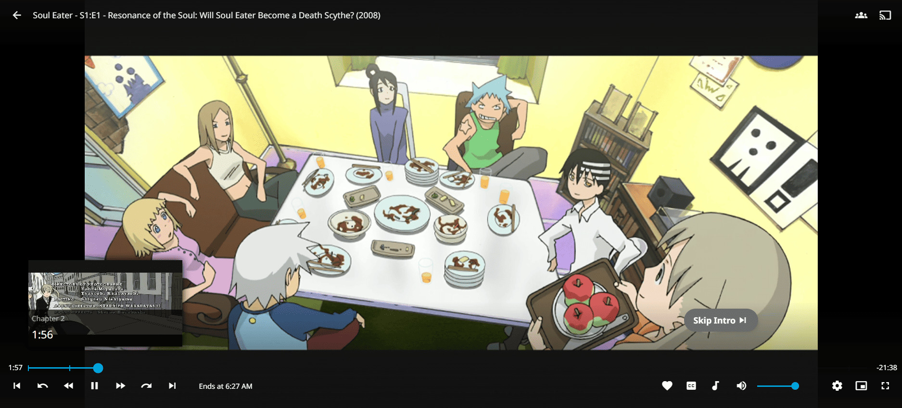
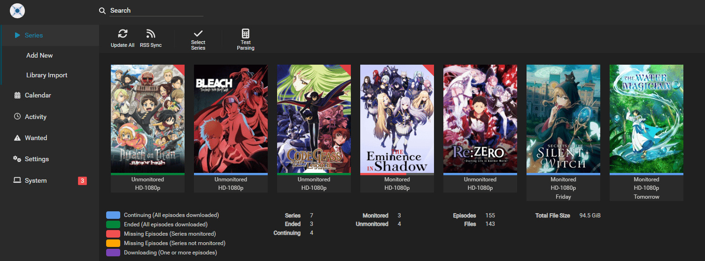
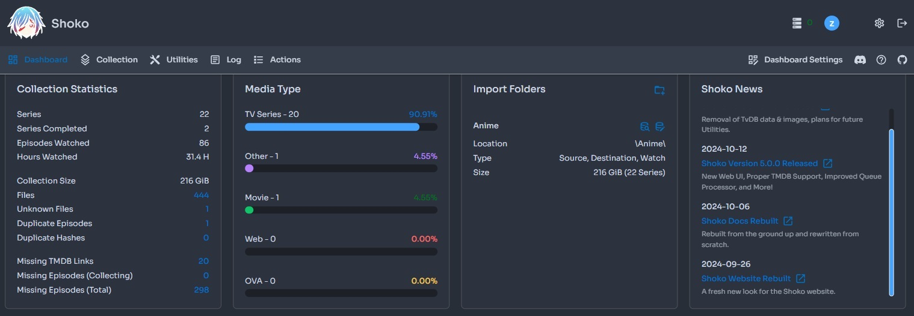

# Advanced HomeLab Services & Security

*by [szy-cmd](https://github.com/szy-cmd)*


An evolving personal homelab combining media automation, virtualization, and security.

## Table of Contents

- [Current Stack](#current-stack)
- [Server Specifications](#server-specifications)
- [Highlights](#highlights)
- [Roadmap](#roadmap)
- [Changelog](#changelog)
- [Documentation](#documentation)
- [Repository Structure](#repository-structure)
- [Project Status](#project-status)
- [Disclaimer](#disclaimer)

## Current Stack

### Media Infrastructure
- **[Jellyfin](https://github.com/jellyfin/jellyfin)** - Self-hosted media streaming server with transcoding support and cross-platform compatibility
- **[Shoko](https://github.com/shokoanime)** - Anime metadata management with AniDB integration and comprehensive cataloging
- **[Sonarr](https://github.com/Sonarr/Sonarr)** - Automated TV show downloading, organization, and quality management
- **[Radarr](https://github.com/Radarr/Radarr)** - Automated movie downloading, library management, and quality upgrades
- **[Prowlarr](https://github.com/Prowlarr/Prowlarr)** - Indexer manager for torrent and usenet sources with unified search

**Status**: ✅ **Media automation pipeline is fully operational with end-to-end content acquisition and library integration.**

## Server Specifications

### Primary Server
- **Processor**: Intel Core i5-9400F @ 2.90GHz (6 cores, 6 threads)
- **Graphics**: NVIDIA GTX 1080
- **Memory**: 47GB RAM
- **Purpose**: Media server, automation, and virtualization host

### Infrastructure
- **Number of Servers**: 1 primary server
- **Operating System**: Windows Server/Linux (TBD)
- **Storage**: Multiple drives for media and system files
- **Network**: Gigabit Ethernet with planned VLAN segmentation

## Highlights

*Jellyfin episode metadata display with detailed information and artwork*


*Jellyfin playback interface showing media preview and controls*


*Sonarr automation dashboard showing active series monitoring and download queue*


*Shoko server interface showing AniDB metadata integration and anime organization*


**Note**: All screenshots are from my personal self-hosted media library. No copyrighted content or download links are included.

See more screenshots and setup details [here](./docs/screenshots.md).

## Roadmap

<details>
<summary><strong>Phase 1: Network Security & Remote Access</strong> ⏳</summary>

- **VPN and secure remote access** - WireGuard/OpenVPN setup for secure external connectivity
- **Reverse proxy** - NGINX/Traefik configuration for secure service exposure  
- **Firewall hardening + VLAN isolation** - Network segmentation and traffic filtering

*This phase focuses on securing external access and implementing proper network segmentation to protect the homelab infrastructure.*
</details>

<details>
<summary><strong>Phase 2: Monitoring & Security Tools</strong> ⏳</summary>

- **Grafana + Prometheus dashboards** - Comprehensive system and service monitoring
- **IDS/IPS tools** - Wazuh, Suricata, and Fail2Ban for intrusion detection and prevention

*This phase implements comprehensive monitoring and security tools to maintain visibility and protect against threats.*
</details>

<details>
<summary><strong>Phase 3: Virtualization & Development</strong> ⏳</summary>

- **VM environments** - Isolated test environments using Proxmox/ESXi
- **F1 Strategy AI project** - Hosting custom AI application in secure VM with web access

*This phase adds virtualization capabilities and hosts custom development projects in isolated environments.*
</details>

## Changelog

<details>
<summary><strong>Completed Versions</strong> ✅</summary>

- **v0.1** - Initial Setup (Jellyfin + Shoko configuration)
- **v0.2** - Media Automation (Sonarr, Radarr, Prowlarr integration)
- **v0.3** - Documentation (Repository structure and README)
</details>

<details>
<summary><strong>Planned Versions</strong> ⏳</summary>

- **v0.4** - VPN and remote access implementation
- **v0.5** - Reverse proxy and SSL configuration
- **v0.6** - Network security and monitoring setup
- **v0.7** - Virtualization and AI project hosting
</details>

## Documentation

- [Roadmap](./docs/roadmap.md) - Detailed development phases and milestones
- [Changelog](./docs/changelog.md) - Complete version history and updates
- [Integration Guide](./docs/integration-guide.md) - Technical setup and configuration details
- [Screenshots](./docs/screenshots.md) - Visual documentation of the homelab setup
- [Jellyfin Plugins](./docs/jellyfin-plugins.md) - Jellyfin plugins and metadata sources

## Repository Structure

```
adv-homelab-sec/
├── docs/                    # Documentation and guides
├── assets/screenshots/      # Visual documentation
├── notes/                   # Development notes and research
├── configs/                 # Configuration files and templates
└── README.md               # Project overview
```

## Project Status

This project is actively maintained and regularly updated. The homelab continues to evolve with new services, security enhancements, and automation improvements. Check the [changelog](./docs/changelog.md) for recent updates and the [roadmap](./docs/roadmap.md) for upcoming features.

## Disclaimer

**Media Content Usage**: Any images of shows, TV series, anime, or movies displayed in screenshots are used solely for educational and informative purposes to demonstrate the functionality of the homelab services. These screenshots serve as proof of functionality for UI interfaces, dashboards, and system capabilities. No copyright infringement is intended, and all media content shown is for technical demonstration purposes only.

---


*Last updated: 2024-12-19*